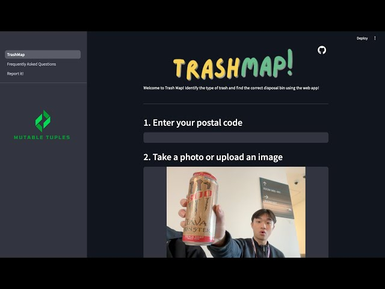

# <p align="middle">🗑️Trash Map🗺️</p>


🗑️A web app to identify waste items and find disposal locations for sustainability 🌳

Trash Map is an AI-powered web app that helps users correctly identify waste items and provides recycling or disposal instructions based on recognized categories. With a user-friendly interface, this application leverages cutting-edge technologies to promote sustainability by guiding users on proper waste management.

# Features
- Image Recognition: Users can upload an image of an item or take a picture directly through the app.
- Google Vision API: Detects and labels the item in the image using Google's powerful vision tools.
- AI Categorization: Uses OpenAI-powered models to classify the identified item into predefined waste categories.
- Recycling Instructions: Clear, concise disposal instructions tailored to the recognized category.
- User-friendly Design: Simple sidebar input for user details and a visually appealing interface.

# Technologies Used
- Streamlit: For building the web application interface.
- Google Cloud Vision API: For image recognition and item detection.
- OpenAI API: For categorizing items and providing context-specific responses.
- JSON: For managing predefined waste categories.
- Pandas & NumPy: For handling and processing data (optional backend enhancements).
- Base64 Encoding: To handle image uploads effectively.

# Installation
1. Clone the repository
```
git clone https://github.com/AlexanderAmpuero/DeltaHacks_2025.git
```
2. Set up a Python Virtual Environment
```
python -m venv .venv
.venv\Scripts\activate           - Windows
source .venv/bin/activate        - macOS/Linux
```
3. Install Required Dependencies
```
pip install -r requirements.txt
```
4. Optain the Following API Keys
- Google Cloud Vision API Key
- PerplexityAI API Key
- Google Geocoding API Key
- Google Places API Key
5. Set up the .streamlit/ folder
- Add Google Cloud Vision credentials in .streamlit/googlekey.json
- Add other keys to .streamlit/secrets.toml
```
[api_keys]
perplexity = "INSERT KEY HERE"
google_geocoding = "INSERT KEY HERE"
google_places = "INSERT KEY HERE"
```
6. Run the Application
```
streamlit run TrashMap.py
```